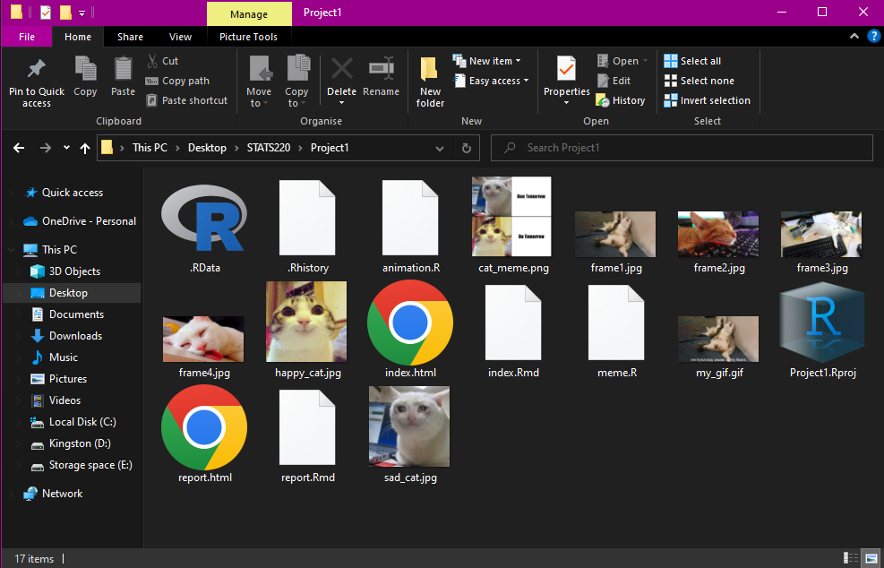

```{css, echo = FALSE}
body {
  font-family: "Lucida Console", "Courier New", monospace;
  background-color: #F25278
}
h2 {
  font-weight: bold;
  text-decoration: underline;
}
.title {
  text-decoration: underline;
  font-weight: bold;
}
```
```{r setup, include=FALSE}
knitr::opts_chunk$set(echo = TRUE)
```

## Project Requirements
I met the requirements of working with GitHub by:

* Signing up with a new account with a responsible name
* Setting up a clear and informative repo utilising markdown
* Setting up GitHub Pages to work with my repo and HTML projects

These 3 things are what we needed to do when setting up and working with GitHub and I am happy with the way things have worked out. Here are my GitHub links:

* **GitHub: [GitHub Profile](https://github.com/chase-kretch)**
* **GitHub Pages: [Pages Link](https://chase-kretch.github.io/stats220/)**

#### Project Folder:


#### Creativity:

My project is just a collection of cat photos I found off the internet that I deemed funny/fitting and put it together with a popular phrase into meme format. The popular phrase may have but put in meme format before but I decided to put it Annas cat 'spin' into it and use cats.

This ideology followed into my gif using cats again but also then making the gif strongly based off a feeling I'm sure we all feel during our time at uni and thought it would be funny to make something relating to our class and experiences while also completing the 2 initial projects. 

In my index html file I tried to format it in an OK way, having underlines to segment different sections and bold to ensure you knew what was the topic of each part. My use of CSS included changing the background color, fonts, bold, underlining etc to make it a little bit more reasonable without overcomplicating it.

I also decided to include this same CSS styling into my report to have some consistency while adding some bullet points and spacing to tie everything together without being over the top which I thought resulted into something simple and consistent.

## Learning Reflection
I really found the combination of multiple platforms and languages to be super useful and cool. The fact this all ties back through one single link is satisfying and makes the whole endeavour worthwhile. This multi-platform project idea is a common thing in the technological industry and so I find this very useful and important for my career and studies.

As for what to explore further I would like to take this working to a higher level and see if I am able to use it for a more pratical purpose such as linking my code together (or multiple peoples) or possibly bringing together statistical models and information that could prove real world use. I assume this is only the surface of R and working with HTML and github and so I am excited to see how deep we will be able to go this sem.

