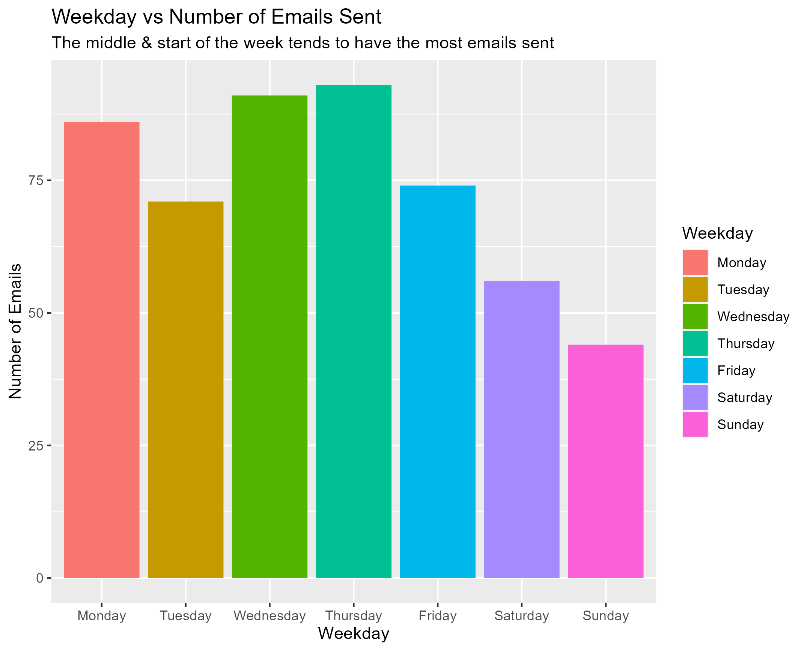

```{r setup, include=FALSE}
knitr::opts_chunk$set(echo = FALSE)
```
```{css}
body {
  font-family: "Lucida Console", "Courier New", monospace;
  background-color: #F25278
}
h2 {
  font-weight: bold;
  text-decoration: underline;
}
.title {
  text-decoration: underline;
  font-weight: bold;
}
```
## Introduction

I decided to focus on a few things for my project 4, which I felt made the most sense. 
These were

1. **Day of the week**
    * and including the number of emails of that day of the week. I think this is good general-purpose information
2. **String count of the email**
    * The length of the email could correlate to a lot of things, but most importantly in my case, a piazza email may be shorter or longer, or same if it was in good sentiment or not.
3. **Whether the email was on Piazza or not**
    * A lot of the emails I receive on my school email are from Piazza so it makes sense for me to see any correlations with it
4. **Whether the email was of good sentiment or not**
    * We were given a sentiment API and so I thought it would be a good idea to use it and view any correlations with my other variables

I chose 3 charts for my visualisation:

* **Bar/Column Chart**
    * Basic graph, easy to read and display something like a variable and counter.
* **Density Chart**
    * A bit more complex but the overlap allows easy interpretation of two variables and their counts/density and to view any correlations
* **Violin Chart**
    * I think its a bit more unique, and being more unique I felt made the animated part made it more interesting. Still is easy to read too
    
I applied the grammar of graphics with every graph and some use different formatting as required by my intention of each graph. I spent a lot of time on the bar chart attempting to get the weekdays to be in the correct order as I learnt ggplot() automatically puts them in alphabetical order (which is pretty annoying to change). Each graph included a subtitle which is new for me and I used it to explain my interpretation of the graph. For the violin graph I also included the state value in the subtitle so the reader could understand what they which state was active.
My density graph I changed the alpha so you are able to see the overlap of the 2 variables which aids in interpreting it. 
Every single graph I ensured the title was accurate and all labels were named appropriately as well. 

I was initially trying to have my bar chart be my animated graph as I thought fading between the months (April and May for my dataset) would be interesting as maybe different months would have a different number of emails per day. I wasn't able to do this as I kept getting errors and wasn't able to get any further than creating the dataset. 
I also tried to creating a 'racing' bar chart' as well but wasn't successful.
I experimented a lot with different plots for my data but some of them didn't fit very well or didn't work at all, which is part of the reason I settled on these specific plots as well.

## Visualisations

#### Bar Chart
The bar chart I created with my email data visualises the fact that emails tend to be sent during the middle of the week (Thurs and Wed), and also have a peak at the beginning of the week as well (Monday). Saturday and Sunday had the least emails sent which is something we would expect.



#### Density Graph

Following on I decided after getting some general data that I would look further into the correlation between the string count of emails and its correlation with other variables. From this density chart we can see that good sentiment emails are typically short when it comes to string count, while bad sentiment tends to be a bit more wider spread. Both have obvious peaks, but the good sentiment peak is very large.


#### Violin Chart Animation

This further develops my study by including Piazza emails which are a large portion of my emails that I feel might have some correlation toward string count and sentiment. Overall it seems as though Piazza emails have more words, and if theyre in good sentiment have a strong tendancy to fall in the 1200 string count range (ignoring the extremes), while bad sentiment piazza emails have less extremes but instead are between approx 1200 and 3000 string count. For non piazza emails, the string count appears to be usually lower on average but the same tendancies appear when good sentiment (good sentiment emails tend to be similar word count to other good sentiment emails).


## Learning Reflection

An import idea I learnt from this is that animated visualisations such as the violin graph are able to provide plenty of information even in such as small package especially compared to a static graph. This is especially useful when designing online graphs where you can make your UI more user friendly and allow them to gather more information with less effort.
I also learnt some things about creating graphs such as organising your variables in the correct order as its sometimes a pain to read if its not familiar order such as the weekdays being in alphabetical than the chronological order theyre normally in.

I decided to use a violin graph as I thought it displayed a bit more uniqueness and was different to some other peoples graphs of choice. I also tried my hardest to make my graphs especially readable and easy to digest such as having the variable state showing in the subtitle of the violin animation so the user knows which one is actually being shown.
I also spent a lot of time attempting to get small things nicely done such as getting the weekdays in the correct order and making the alpha of the density graph lower so the user is able to see the other graph underneath it and understand that is going on even if they cover each other.
There are other things such as how I renamed the legend values and titles to be more fitting and understandable for the user as well.
I believe the small things like this make a large difference. 

As I said earlier I found the animated visualisations to be particularly useful at getting a lot of data into a small space which is a whole subject in itself that its quite interesting. As someone who is also interested in UX and UI I find these to be cool and something that could be used to a very large potential for having concise yet informative reports which are useful in the real world as people don't have a lot of time. 


## Appendix

```{r file='exploration.R', eval=FALSE, echo=TRUE}

```
